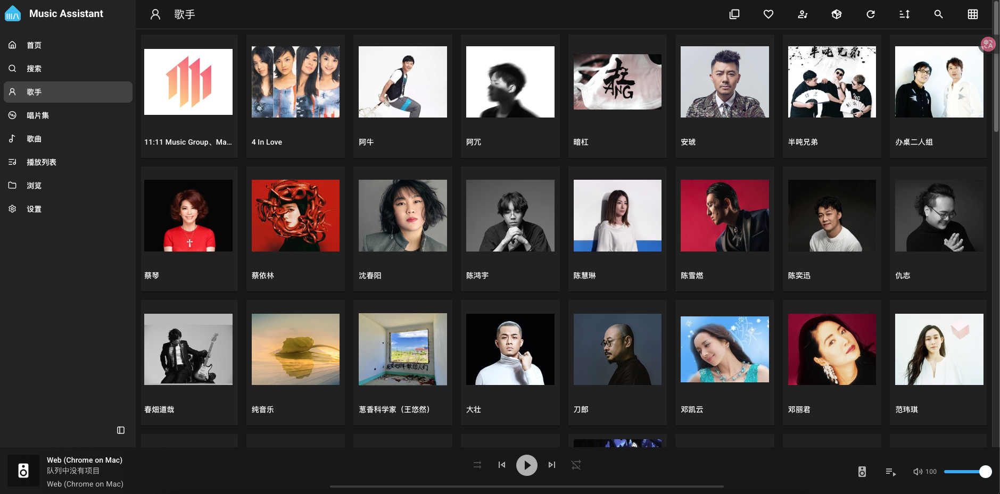
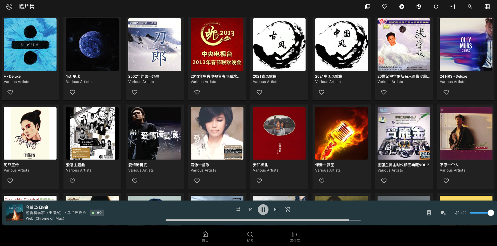
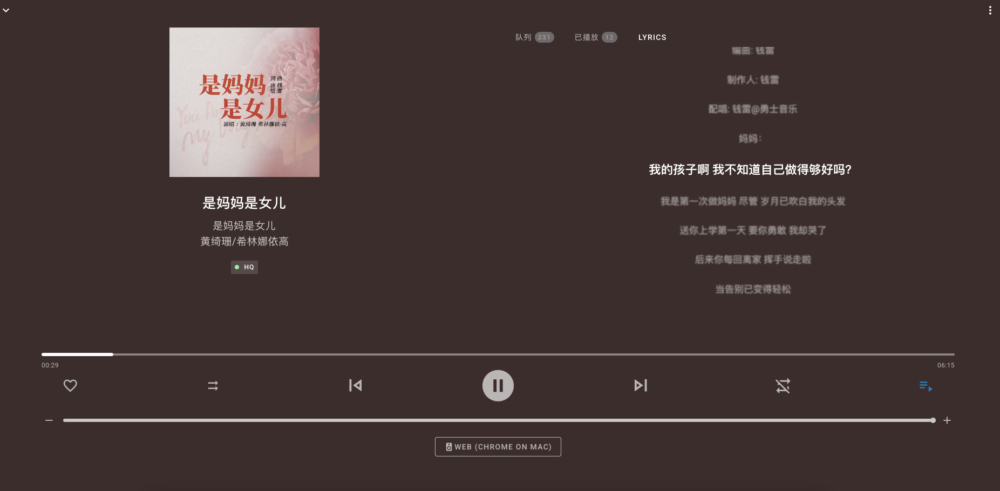

#### 📖介绍

适合国人使用 Music Assistant 最强插件，支持歌手（简介）、专辑、图片、歌词自动补全 







#### 🎯插件代码是本人学习Pytone时编写及豆包修正生成的，歌曲元数据来源需要配合云音乐API使用。 插件代码绿色开源，符合Music Assistant插件开发Demo。

- 主要解决国内使用时Music Assistant的UI歌手图片经常获取不了问题
- 本次插件由 musicbrainz魔改版 和 netease_metadata同共使用（也可以独立使用，需要原版musicbrainz正确识别到数据后才能触发插件）
- 为什么要魔改musicbrainz，因为Music Assistant默认先识别这个插件更新元数据信息，又不能禁用此插件。我们国人在使用时会经常遇到网络等各种问题识别不了元数据，从而触发不了其它插件运作。经过源码分析出原因由于元数据在musicbrainz上有各国语言版本出现，对应的简体元数据比较少，所以经常获取不了数据。如果大家有喜欢的歌手或歌曲也可以去平台上补充下。MusicBrainz,开放音乐百科全书,最全的音乐元信息数据库。

### 🏗️ 项目结构

```
main/
├── gd_studio_music/    #GD音乐源
├── musicbrainz/    #魔改版
├── netease_metadata/ #元数据补全插件
├── netease_lyrics/     # 歌词插件
└── README.md         # 说明文档
```

### 📚使用教程

docker compose 版安装

```
services:
  music-assistant-server:
    image: ghcr.nju.edu.cn/music-assistant/server:latest # 南京大学源可替换为beta版本以获取最新测试版
    container_name: music-assistant
    restart: unless-stopped
    # 网络模式必须设置为host，Music Assistant才能正常工作
    network_mode: host
    volumes:
      - ./providers/netease_metadata:/app/venv/lib/python3.13/site-packages/music_assistant/providers/netease_metadata  # 插件目录挂载
      - ./providers/musicbrainz:/app/venv/lib/python3.13/site-packages/music_assistant/providers/musicbrainz  # musicbrainz
      - ./providers/netease_lyrics:/app/venv/lib/python3.13/site-packages/music_assistant/providers/netease_lyrics  # netease_lyrics
      - ./providers/gd_studio_music:/app/venv/lib/python3.13/site-packages/music_assistant/providers/gd_studio_music # GD_Studio_music
      - ./data:/data #数据持久化
      - /你的音乐存放目录:/music  #挂载本地音乐目录
    cap_add:
      - SYS_ADMIN
      - DAC_READ_SEARCH
    security_opt:
      - apparmor:unconfined
    environment:
      # 日志级别配置，默认值为info，可选值：critical、error、warning、info、debug
      - LOG_LEVEL=info
      - TZ=Asia/Shanghai
```


home-assistant 加载项使用教程
https://github.com/neqq3/ma_custom_loader


###  :tw-26a0: 提醒
本插件需要依赖网易云音乐 API Enhanced,请自行部署
https://gitee.com/a1_panda/api-enhanced

docker compose 部署云音乐API

```
services:
  ncm-api:
    container_name: ncm-api
    image: moefurina/ncm-api:latest
    ports:
      - "3003:3000"
    restart: always
    user: root
    environment:
      - TZ=Asia/Shanghai
    network_mode: bridge 
```
###  :speech_balloon: 参与贡献

欢迎所有形式的贡献，包括但不限于：
1. 🐛 提交 Bug 报告
2. 💡 提出新功能建议
3. 📝 改进文档
4. 🔧 提交代码修复或新功能

###   ⚠️ 免责声明
本项目仅供学习和研究使用，使用本项目所产生的一切后果由使用者自行承担。请遵守相关法律法规，不得用于非法用途。

如果这个插件对你有帮助，欢迎点一个 Star ⭐
